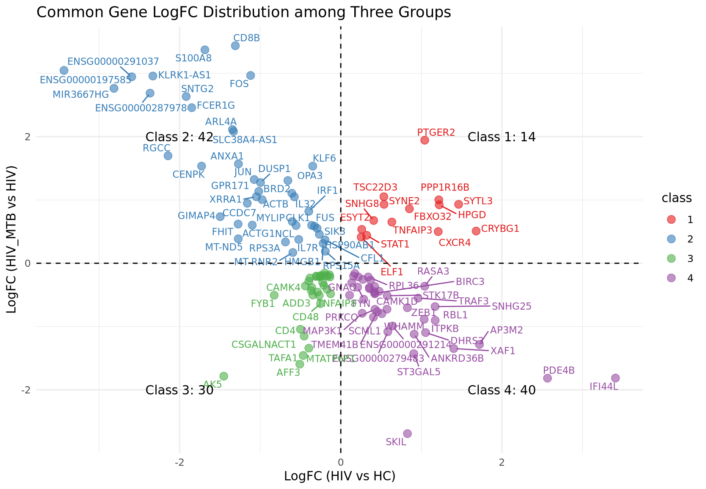
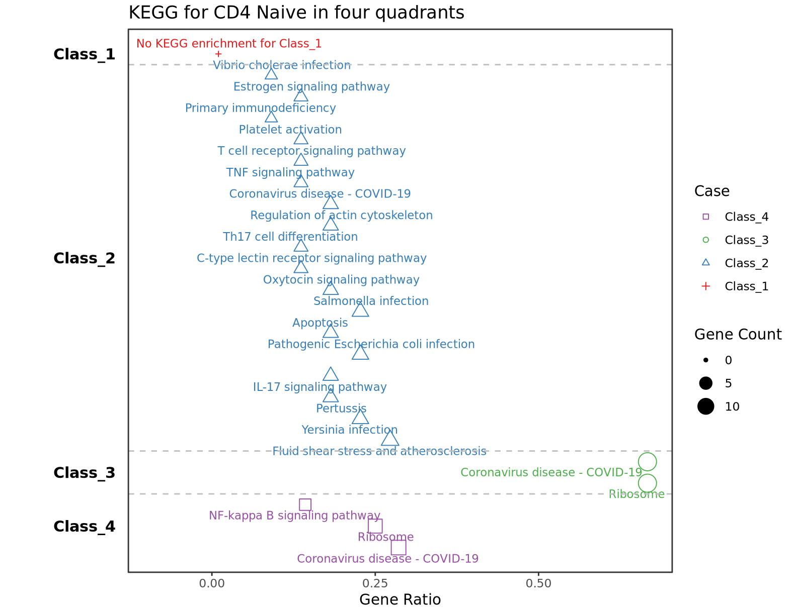

# ThreeGroupQuadDiff
[](https://doi.org/10.3389/fimmu.2025.1680538)
## For the Beginning

**Note:** `markers_df_hhc` & `markers_df_hth` are dataframes from the `Seurat::FindMarkers` function.

**Important:** Please ensure that you execute `Seurat::FindMarkers` in the proper sequence. In `Seurat::FindMarkers`, the group specified by ident.1 is treated as the test group, while ident.2 is treated as the reference group.

**For example,** the disease progression follows the order: `HC → HIV → HIV/MTB`.


```r
markers_df_hth <- Seurat::FindMarkers(object = seurat_obj, ident.1 = "HIV_MTB", ident.2 = "HIV", assay = "RNA")
markers_df_hhc <- Seurat::FindMarkers(object = seurat_obj, ident.1 = "HIV", ident.2 = "HC", assay = "RNA")
```
The test dataset and corresponding script are located in `./data/*.rds` and `./sample_data.R`, respectively. Simply running `sample_data.R` will reproduce the exact plot shown in this repository.

## Main Executable Lines
### Load the functions
```r
source("define_functions.R")
```

### Step 1: Select the common features of the two datasets.
```r
markers_df_common <- common_de_marker_selection(
  de_list_1 = markers_df_hhc,
  de_list_2 = markers_df_hth,
  suffix_list = c("_hhc", "_hth"),
  xtitle = "LogFC (HIV vs HC)",
  ytitle = "LogFC (HIV_MTB vs HIV)",
  plot_title = "Common Gene LogFC Distribution among Three Groups"
)
print(markers_df_common$plot)
```


### Step 2: Convert the combined list.
```r
mart <- biomaRt::useMart("ensembl", dataset = "hsapiens_gene_ensembl")
converted_common_markers <- common_de_geneid_converter(
  common_de_list = markers_df_common$common_markers, mart = mart
)
```
### Step 3: Enrich the common list using databases.
```r
common_enrich <- common_markers_enrichment(converted_common_markers)
```
**Hint:** You might consider integrating additional databases at this stage, such as `REACTOME` and `WikiPathways`, among others.

### Step 4: Select the common features of the two datasets.
```r
p1 <- common_plot_kegg_results(
  common_enrich,
  hjust = 1.7,
  title = "KEGG for CD4 Naive in four quadrants"
)
print(p1)
```

## Suggest Citations
```r
print("Please consider cite the packages 'clusterProfiler' used in this repository.")
print("If this project contributes to your research, citation of the associated paper would be appreciated.")
url <- "https://doi.org/10.3389/fimmu.2025.1680538"
cat("Link to our paper:", url, "\n")
```
